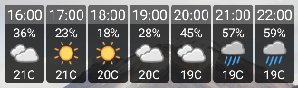
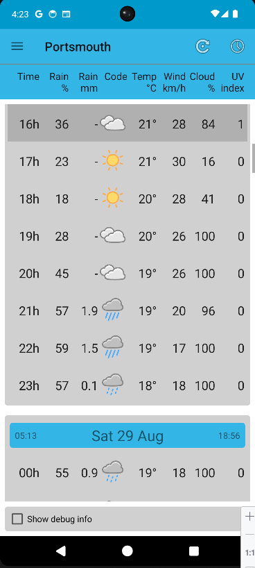

# Purpose
minimal android widget to show weather for next 8 hours.

i use it to see when i can take the dog out ;)

# Usage
add the widget to your home screen, then click it to launch an activity which you can do further configuration from

no attempt is made to track your current location as 1/ it's creepy 2/ geofencing is quite involved (idk where/how i'd even show a name)
so instead you manually set your location and can manage a set of locations to switch between.
this can actually be quite useful if you want to fetch a long range forecast for somewhere you are going ahead of time (eg. a festival with poor data coverage).
location management is hopefully relatively sane.

at time of writing, supported data source is open-meteo: good usage policy, aggregated sources, clean data.
the activity itself shows detail and lets you configure columns, the widget is not configurable yet.

forecast periodically fetched in background on a random N minute offset from the hour (to avoid on the hour spamming)

widget repainted on the hour with the last forecast data it fecthed

# Preview

